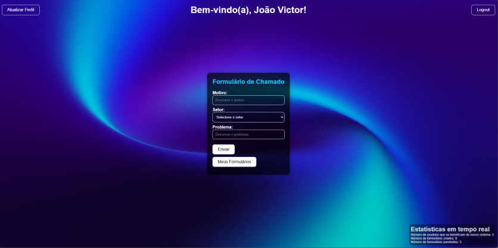
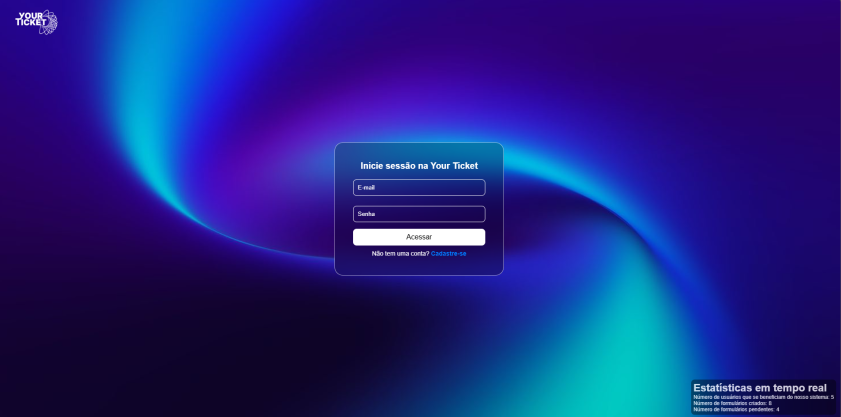

<h1 align="center" style="font-weight: bold;">Form Processing Frontend 💻</h1>

<p align="center">
 <a href="#descricao">Descrição</a> • 
 <a href="#funcionalidades">Funcionalidades</a> • 
 <a href="#instalacao">Instalação</a> • 
  <a href="#colab">Colaboradores</a>
</p>

<p align="center">
    <b>Aplicação frontend em React para envio e acompanhamento de solicitações de suporte, com gestão de status pelos administradores.</b>
</p>

<p align="center">
     <a href="https://github.com/Keyllian7/Form-Processing-Front">📱 Visite o Projeto</a>
</p>

<h2 id="layout">🎨 Layout</h2>

<p align="center">
    
    
    
</p>

<h2 id="descricao">📄 Descrição</h2>

Este projeto implementa o frontend do sistema Form-Processing, permitindo que usuários e administradores interajam com a API para envio e acompanhamento de formulários.
- Usuário: Cria e envia solicitações relatando problemas, além de acompanhar o status de suas requisições.
- Admin: Acessa uma interface para gerenciar as solicitações, atualizando o status e resolvendo problemas.

O frontend foi desenvolvido utilizando React para criar uma interface moderna e responsiva. Diversas bibliotecas adicionais foram utilizadas para otimizar a experiência do usuário e a comunicação com a API, como:

- axios para requisições HTTP
- dompurify para sanitização de HTML e proteção contra ataques XSS
- jwt-decode para decodificação de tokens JWT
- react-router-dom para gerenciamento de rotas no React
- react-google-recaptcha para integração do Google reCAPTCHA.
- recharts para criação de gráficos em React.

Este projeto foi desenvolvido como parte do trabalho da A3, focando em melhorar a comunicação e gestão de solicitações, com uma interface intuitiva que complementa o backend robusto.

<h2 id="funcionalidades">💻 Funcionalidades</h2>

- Interface para criação e envio de formulários detalhados.
- Validação de dados no lado do cliente (ex.: número de telefone e formato de e-mail).
- Feedback visual para ações do usuário (ex.: mensagens de erro/sucesso).
- Navegação entre telas de forma dinâmica usando React Router.
- Comunicação em tempo real com a API para atualização do status das solicitações.

<h2 id=instalacao>🚀 Instalação</h2>

Para clonar o repositório e instalar as dependências:

<h3>Pré-requisitos</h3>

- Node.js
- npm ou yarn
- Visual Studio Code (Opcional)
- bash, zsh, fish ou um shell de terminal de sua escolha

<h3>Passo a Passo</h3>

1. Clone o repositório:
   ```bash
   git clone https://github.com/Keyllian7/Form-Processing-Front.git
   ```
2. Acesse o projeto e instale as dependências:
   ```bash
   cd Form-Processing-Front
   npm install dos seguintes pacotes
   axios
   date-fns
   dompurify
   form
   jwt-decode
   react
   react-dom
   react-google-recaptcha
   react-hook-form
   react-router-dom
   react-scripts
   recharts
   sockjs-client
   web-vitals
   ```
3. Execute o projeto em modo de desenvolvimento:
   ```bash
   npm start
   ```
4. Abra no navegador: O frontend estará disponível em http://localhost:3000.

<h2 id="colab">🤝 Colaboradores</h2>

Os alunos envolvidos em todo o projeto.

<table>
  <tr>
    <td align="center">
      <a href="#">
        <br>
        <sub>
          <b>Keyllian Azevedo</b>
        </sub>
      </a>
    </td>
    <td align="center">
      <a href="#">
        <br>
        <sub>
          <b>Romeu Lucas</b>
        </sub>
      </a>
    </td>
    <td align="center">
      <a href="#">
        <br>
        <sub>
          <b>Ryan Pedro</b>
        </sub>
      </a>
    </td>
    <td align="center">
      <a href="#">
        <br>
        <sub>
          <b>João Victor</b>
        </sub>
      </a>
    </td>
    <td align="center">
      <a href="#">
        <br>
        <sub>
          <b>Gustavo Kauã</b>
        </sub>
      </a>
    </td>
  </tr>
</table>

<h2>Licença</h2>
Este projeto está licenciado sob a Licença MIT.
